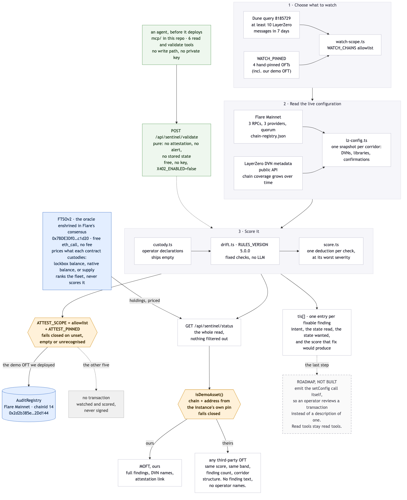
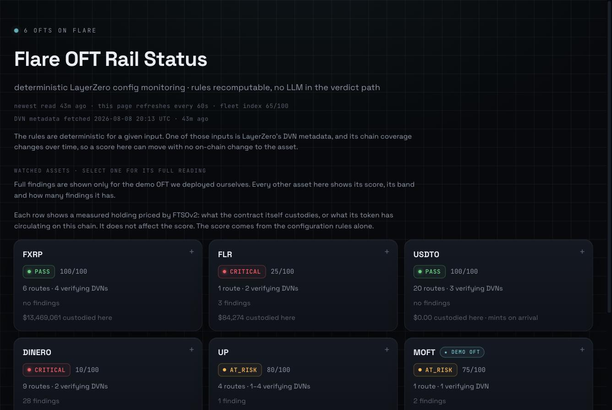

# flare-oft-sentinel

A machine that re-reads the cross-chain safety settings of Flare's LayerZero
tokens every cycle and publishes a verdict anyone can recompute.

## Start here

**What it does.** Reads the live LayerZero configuration of six OFTs on Flare
Mainnet, scores each against a fixed rule set, and alerts when a reading changes.
When the verdict for the one asset it may sign about changes, it writes a hash of
that verdict to a contract on Flare. No model sits anywhere in the verdict path.

**How much rides on it.** Flare's OFT corridors have carried **$1.78 billion in
and out across 45,646 messages**, and **$137 million of that in the last 90
days**. This watches all of them bar a rounding, which the
[watchlist section](#what-this-instance-watches) quantifies. Measured from LayerZero's own Dune tables, query
[8265924](https://dune.com/queries/8265924), execution `01KZHEMZV74KDS6D2HEC8TSCMR`,
read 2026-08-08. In and out, not into: the same execution splits them, $896M in
against $886M out, and merging the two into an "into Flare" figure would roughly
double the claim.

**Why that number is not the risk.** The loss is not spread across those 45,646
messages. A verification stack decides whether an inbound message is real, and
where one has been defeated, a single accepted message can carry the entire
loss, and has. Volume tells you what is at stake. The message count tells you
nothing about the risk. The configuration does, and it changes rarely. Rare is
exactly what a human misses: nobody stays vigilant for the one cycle in a
thousand that differs from the nine hundred and ninety-nine before it.

**What this can see, and what it cannot.** It reads configuration. It cannot tell
you that someone is, at this moment, compromising the infrastructure a verifier
depends on. What it can tell you is whether your configuration is one where a
single defeated verifier would be enough on its own. Those are different
questions, and only the second is answerable from the chain. This answers the
second one, every cycle, and shows its work.

**Where it is running.** The page is at
<https://flare-oft-sentinel.netlify.app/flare.html> and the API behind it at
<https://flare-sentinel-api-production.up.railway.app>. Two of the six read
CRITICAL today, which is the tool working.

**What existed before this program.** OFT Sentinel did. The rule engine, the
scoring, the chain-read layer, the contracts, the API and the MCP server are
prior work. The [provenance
table](#what-was-already-built-what-is-new-what-was-ported) marks every part as
prior, ported or new, file by file, and the engine's claim is checkable against
its public upstream with [a recipe you can
run](#check-it-yourself-without-taking-our-word-for-any-of-it).

**What was built during it.** The Flare instance: the registry and its alert
contract deployed on Flare Mainnet, plus the demo OFT beside them, which is the
three transactions in the table below. The scope module that decides what gets
read and what may ever be signed, the Flare watchlist query, the judge page, the
FTSOv2 read that prices what each contract is holding, and one scoring fix
published below as a diff.

**How Flare is used.** [The list is here](#how-this-uses-flare). The one worth
naming at the top: two of the six are on the watchlist because Flare's own
message traffic put them there, not us, and that is how FXRP arrived. We pinned
the other four so the list covers the whole fleet.

**What this repository is.** A sanitised export of a private monorepo, so its
history starts at the export rather than at the first line of work. [What that
means, and what to read instead](#about-this-repository).

## What this is, in plain words

A token that moves between chains (an OFT) is as safe as a configuration almost
nobody reads: which verifiers must sign off on a message, which libraries carry
it, who can change either. That configuration changes rarely, and rare is exactly
what a human misses, so the check has to be a machine that runs on a schedule and
shows its work.

An audit photographs the code at one moment. It cannot catch a change made after
the photo, and the changes that matter here are made after the photo, in public,
by a transaction anyone could have read.

This repository is a Flare-scoped instance of **OFT Sentinel**. It:

1. asks Flare's on-chain activity which LayerZero OFTs carry traffic (a saved
   Dune query, `>= 10 messages in 7 days`), alongside a short hand-pinned list
   described below,
2. reads each one's live LayerZero configuration from Flare Mainnet,
3. runs a fixed rule set over that reading. No model, no judgement call, and the
   same input always gives the same verdict,
4. writes a hash of the verdict to an `AuditRegistry` contract **on Flare
   Mainnet**, so a chain timestamps the result instead of us. This covers the
   assets the instance may sign about, which is a one-item list by design,
5. shows the current state on one page.

No LLM sits anywhere in the verdict path. The rules are `RULES_VERSION`
`5.0.0` and they live in `backend/src/services/drift.ts`.

**What "the same input always gives the same verdict" covers, and what it does
not.** The rules are deterministic. Hand them the same reading and they produce
the same verdict, on your machine as much as ours. But the reading is more than
what we fetch from the chain. It includes LayerZero's published DVN metadata, and
that metadata's **chain coverage grows over time**.

That has a consequence worth stating, because it looks like a bug the first time
you meet it: **a score can move while nothing changes on-chain.** Some rules run
only when every verifier on both sides of a route resolves to a known name. An
unresolved address compares unequal to everything, which would manufacture a
difference that is a gap in our knowledge, so those rules stay silent instead.
Once the metadata covers a chain it did not cover before, such a rule runs for
the first time and can report something that held all along. The finding became
visible on that date. It was already true.

So any score printed in a document is a reading from a moment.
The page shows the metadata's fetch time for that reason, and the number to trust
is whichever one the instance is serving now.

### What this instance watches

**Six OFTs, arriving two different ways.**

Two arrive on their own. The traffic rule picks **USDT0**
(`0x567287d2a9829215a37e3b88843d32f9221e7588`) and **FXRP**
(`0xd70659a6396285bf7214d7ea9673184e7c72e07e`). Nobody hand-picks those two. The
saved Dune query does.

Four more are pinned by hand in `WATCH_PINNED`: three live Flare OFTs whose
all-time volume is real but whose last seven days sit under the threshold, plus
**our own demo OFT**, which has no traffic history at all. The pins live in
`backend/.env.flare.example`, so you can read the watchlist as configuration
instead of digging it out of code. Between them, the six carry all but a
rounding of the value that has ever crossed Flare's OFT corridors. The all-time
query ([8265924](https://dune.com/queries/8265924), read 2026-08-08) returns six
tickers, and the only one outside this list is a legacy symbol under the same
project as USDT0, worth $2.8M of a $1.78B total. Treat that as a reading of a
public dataset on a date. An OFT deployed on Flare tomorrow would change it, and
picking that up without anyone editing a list is what the traffic rule is for.

The same rules read and score all six. Nothing is graded on a curve because an
asset belongs to someone else, and **some of the live assets read CRITICAL
today**. That is the tool doing its job.

**The page shows different amounts of detail depending on whose asset it is, and
it errs in one direction.** For a third-party OFT it gives the score, the risk
band, how many findings there are, and each corridor's structure: how many
verifiers it uses, and whether its message libraries are pinned or left on the
default. It does not print the findings themselves, and it names no DVN operator.
One asset gets full detail, **the demo OFT we deployed ourselves**, because that
is the one we may describe in public.

This softens nothing and hides no score. A third-party asset reading CRITICAL
says CRITICAL, in the same words, with the same number. What we hold back is the
narration of somebody else's live configuration, which belongs with that asset's
owner before it belongs on a public page. This document holds the same line and
stays at the pattern level throughout.

**Where that line runs matters, because it is a property of the page rather than
of the system.** The filter sits in the render layer. The engine still computes
every finding and `/api/sentinel/status` still returns them, by design: the
copilot and the report route reason over the whole read, and a monitor that lies
to its own tools is worse than one that says too much. So the page holds back and
the raw API does not. Call the endpoint yourself and you will see third-party
findings and DVN operator names. Better that you know before you call it.

**Reading an asset and signing about it are two different permissions.** Of the
six, our own demo OFT is the only one this instance can write to the registry.
See `ATTEST_SCOPE` and `ATTEST_PINNED` under [Environment](#environment). We
deployed that OFT and left it on the endpoint's default configuration, so we can
demonstrate the detection path end to end on an asset that is ours to break. It
holds no value and nothing depends on it.

## Architecture: one cycle, end to end



Source for the diagram is [`assets/architecture.mmd`](assets/architecture.mmd),
so you can regenerate it rather than trust the image:

```bash
npx -y @mermaid-js/mermaid-cli -i assets/architecture.mmd -o assets/architecture.png -b white -s 2
```

**Stage 1 picks the fleet.** `watch-scope.ts` takes two inputs, the Dune query's
traffic-selected OFTs and the hand-pinned list in `WATCH_PINNED`, and filters both
through the `WATCH_CHAINS` allowlist. Pinned assets bypass the traffic threshold,
which is how a demo OFT with no history gets watched at all.

**Stage 2 reads the chain.** `lz-config.ts` builds one snapshot per corridor:
required and optional DVNs, the send and receive libraries, block confirmations.
Reads go through a three-provider quorum from `chain-registry.json`, so no single
RPC decides a verdict. DVN addresses resolve to operator names through LayerZero's
public metadata, and that resolution is the input whose coverage grows over time.

**Stage 3 scores it.** `drift.ts` runs the fixed checks at `RULES_VERSION`
`5.0.0`, reading operator custody declarations from `custody.ts`
where they exist. `score.ts` turns findings into a number, one deduction per
distinct check at that check's worst severity.

**Then two gates, and they are the parts worth reading.**

The **attest gate** decides what this instance signs. `ATTEST_SCOPE=allowlist`
plus `ATTEST_PINNED` narrows on-chain writes to the demo OFT. The other five are
read and scored on the same rules and never reach a transaction. Unset, empty or
unrecognised values attest nothing, so a typo cannot widen it.

The **render filter** decides what the page says. `/api/sentinel/status` returns
the whole read, and `isDemoAsset()` splits the page: our own asset shows full
findings and DVN names, and a third-party asset shows the same score and band with
the finding text held back. It compares chain plus address against the instance's
own pin instead of a ticker, and it answers "theirs" while the chain list is still
loading, so a slow load cannot leak.

**The green path on the left is the same engine, reached before a deploy exists.**
Stages 1 and 2 answer "what is out there right now". An agent about to ship a
config has no on-chain deployment to read, so it posts the proposed config to
`/api/sentinel/validate` and gets a verdict from stage 3 without touching stages 1
or 2. Same rules, same version, no attestation and no stored state. The MCP server
that wraps it is `mcp/` in this repository. See
[§4 below](#4-the-rule-engine-before-anything-ships) for both.

**The dashed box is the only thing on this diagram that does not run.** Every
fixable finding already comes back as a `tis` entry carrying an intent, the state
read, the state wanted, and the score that fix would produce. Emitting the
`setConfig` call itself is the step after that, and it is
[on the roadmap](#roadmap) rather than in the build. Everything else here is live
today.

## Live

| | |
|---|---|
| **Rail status page** (start here) | https://flare-oft-sentinel.netlify.app/flare.html |
| Backend API | https://flare-sentinel-api-production.up.railway.app |
| Status endpoint | `https://flare-sentinel-api-production.up.railway.app/api/sentinel/status` |

## If you have five minutes, do this

The page is live and nothing below needs an account, a key, or an install.



*Captured 2026-08-08. It is here as a fallback, not as evidence: the live link
below is the thing to trust, and this is only so you can see what you were meant
to see if the host is having a bad day while you are reading. Nothing in it is
arranged. It is the default view of the page with no card opened.*

1. **Open <https://flare-oft-sentinel.netlify.app/flare.html>.** Six tiles, one
   per watched OFT, each with a score and a risk band. **Two of them read
   CRITICAL.** Those are live third-party tokens and the tool is not softening
   them.
2. **Notice what the third-party tiles do not show.** Score, band, finding count
   and corridor structure, but no finding text and no verifier names. That line
   is drawn on purpose and [the reason is here](#what-this-instance-watches).
3. **Open the tile marked as ours, `MOFT`.** This one shows everything: both
   findings in full, the verifier names, the corridor. We deployed it and left it
   on the endpoint's defaults so the detection path could be shown on an asset
   that is ours to break.
4. **Read its remediation block.** It does not only say what is wrong. It says
   what the score becomes once you fix it: **75 to 95**. That is the engine
   scoring the fixed configuration before anyone touches the chain.
5. **Check a number against the chain instead of against us.** The registry's
   attestation count is one call, no toolchain:

   ```bash
   curl -s -X POST https://flare-api.flare.network/ext/C/rpc \
     -H 'content-type: application/json' \
     --data '{"jsonrpc":"2.0","id":1,"method":"eth_call","params":[{"to":"0x2d2b385eb0375aBD74d5174a4f738B0B142Dd144","data":"0x2ddbd13a"},"latest"]}'
   ```

   [What that number means, and why it has been small](#contracts-on-flare-mainnet).
6. **Score a configuration of your own**, with no key and no payment, using
   [`POST /validate`](#4-the-rule-engine-before-anything-ships). The engine runs
   as a pure function: no attestation, no alert, nothing stored.

If you have twenty minutes instead, [run the rules on your own
machine](#run-it-yourself) and [rebuild the engine from its public
upstream](#check-it-yourself-without-taking-our-word-for-any-of-it) to check that
the scoring is what we say it is.

## How this scores against the bounty

Bounty 1, Interoperable Asset Products. Each row links to the evidence rather
than restating it.

| Criterion | Where it is answered |
|---|---|
| **Product usefulness** | A cross-chain token's safety lives in a configuration almost nobody reads, and a single accepted message can carry the whole loss. This reads that configuration every cycle for the whole Flare fleet and shows its work. [The problem](#what-this-is-in-plain-words) |
| **Flare integration quality** | Flare's own traffic picks the watchlist, FTSOv2 prices what each contract holds, Flare Mainnet holds the record, and Flare's explorer constraint is handled in the open. [Four ways](#how-this-uses-flare) |
| **Technical execution** | A live page, a live API, contracts source-verified on Flare, a suite whose measured size is stated under [Run it yourself](#run-it-yourself), and an engine you can rebuild from its public upstream and diff. [Check it yourself](#check-it-yourself-without-taking-our-word-for-any-of-it) |
| **Evidence of new work** | A provenance table marking every part prior, ported or new, file by file, plus three chain-timestamped deploy transactions. [The table](#what-was-already-built-what-is-new-what-was-ported) |
| **Clarity and future potential** | Automatic remediation is one step away and the engine already produces its inputs; FDC would put the metadata dependency on-chain. Both are named with the reason they are not in this build. [Roadmap](#roadmap) |

## What was already built, what is new, what was ported

Honest provenance matters more than a bigger-looking diff. OFT Sentinel existed
before this program. The engine below is upstream's with one change made during
the program, shown in the next section, and you can reproduce it byte for byte
with the recipe under
[Check it yourself](#check-it-yourself-without-taking-our-word-for-any-of-it).

| Part | Status | Where |
|---|---|---|
| Rule engine (`drift.ts`), the checks that decide a verdict | **prior work**; no rule added, removed or re-labelled | `backend/src/services/drift.ts` |
| Scoring (`score.ts`) | **prior work**, plus the one disclosed change below | `backend/src/services/score.ts` |
| Scoring fix: one deduction per distinct check, at its worst severity | **new during the program** (2026-07-29) | `backend/src/services/score.ts` |
| `RULES_VERSION` 5.0.0, the version that says scores changed meaning | **new during the program** (2026-07-29) | `backend/src/services/drift.ts` |
| Chain reads (`lz-config.ts`), the snapshot of a live LayerZero config | **prior work**, unmodified | `backend/src/services/lz-config.ts` |
| `AuditRegistry.sol` / `AlertBus.sol` | **prior work**, ported to a new chain | `contracts/contracts/` |
| Multi-RPC quorum registry, dashboard components, API layer | **prior work**, ported | `backend/`, `frontend/` |
| `watch-scope` module: env-driven chain allowlist, pinned assets, attest scope | **new during the program** | `backend/src/services/watch-scope.ts` |
| `WATCH_CHAINS` / `WATCH_PINNED` wiring into watchlist assembly | **new during the program** | `backend/src/services/dune.ts`, `sentinel.ts` |
| `ATTEST_SCOPE=allowlist` + `ATTEST_PINNED` gate on the on-chain attest call sites | **new during the program** | `backend/src/services/attestor.ts`, `backend/src/services/orchestrator.ts` |
| Flare active-OFT Dune query (`8185729`), env-overridable | **new during the program** | `backend/src/services/dune.ts` |
| `flare` network entry for Hardhat (chainId 14) | **new during the program** | `contracts/hardhat.config.ts` |
| Flare rail-status page (second Vite entry) | **new during the program** | `frontend/flare.html`, `frontend/src/components/FlareRailStatus.tsx` |
| `AuditRegistry` deployed on Flare Mainnet | **new during the program** | see addresses below |
| Demo OFT deployed on Flare Mainnet | **new during the program** | see addresses below |
| MCP server, six read and validate tools | **prior work**, ported; its defaults re-pointed at this instance and Flare Mainnet | `mcp/` |
| `X402_ENABLED` gate on `POST /validate` | **new during the program** | `backend/src/routes/sentinel.ts` |
| FTSOv2 feed reader: feed-id encoding, ticker to feed map, staleness guard | **new during the program** | `backend/src/services/ftso.ts` |
| Holding reader: OFT shape detection, custodied and circulating bases | **new during the program** | `backend/src/services/exposure.ts` |
| Exposure on `/status` and on the page, with its provenance line | **new during the program** | `backend/src/routes/sentinel.ts`, `frontend/src/rail-logic.ts` |
| This repository | **new during the program** | you are here |

### About this repository

This tree is a sanitised export of a private monorepo. A script copies an
explicit allowlist of paths, runs its checks over the result, and deletes the
whole tree if any of them trips, so a failed export cannot leave something
publishable behind. Those checks include a secret scan, a vocabulary sweep, the
engine digest pins published below, and a gate that rebuilds the page and
verifies that claims this file makes about it actually ship in the bundle. The
private tree itself cannot be published: it holds deployment credentials,
findings about third-party assets that are shared in confidence with the parties
they concern, and work unrelated to this submission.

The visible consequence is that the history starts at the export rather than at
the first line of work. Two things stand in for it, and both are harder to fake
than a commit log:

- **Flare timestamps the deploy transactions**, not us. The three transactions
  in [Contracts on Flare Mainnet](#contracts-on-flare-mainnet) are the dated
  record of when this instance reached the chain, and you can read them without
  asking us anything.
- **The engine's provenance is checkable against its public upstream.** The
  recipe in [Check it
  yourself](#check-it-yourself-without-taking-our-word-for-any-of-it) rebuilds
  the three engine files from a public clone and prints the digests published
  here. If we had taught the engine to return a kinder verdict without saying
  so, that recipe would catch it.

Commits from here forward are ordinary commits with real dates.

### The engine is upstream's, plus one disclosed change

A security tool stands or falls on one claim: the rules that clear or raise a
finding are not rules the demo taught it to raise.

Three files carry the rules. `score.ts`, `drift.ts` and `lz-config.ts` differ
from upstream `main` by **one commit and nothing else**, a scoring fix dated
**2026-07-29**, inside this program's development window, which opened on
2026-06-29. We improved the engine during the program. Those three files are the
ones hash-pinned below, and the verification recipe checks them.

**They are not the whole verdict surface, and implying otherwise would mislead
you.** `drift.ts` also imports `custody.ts` and `chain-registry.ts`. Both changed
during this program and **neither is pinned or hash-gated**. Custody matters
most: a custody declaration can downgrade an owner-EOA finding from HIGH to LOW,
so a file outside the pinned set can move a score. It takes operator input from a
local file, it ships empty here, and you can read all of it. Know it exists
before you read "three files" as a guarantee.

Here is the scoring change.

**What was wrong.** `computeScore` subtracted a deduction for every finding.
Findings are raised **per route**, so one uniform condition was deducted once per
corridor, and the score measured how many chains a token is deployed on as much
as how exposed it is. A token on six corridors, each carrying the same two minor
advisories, accumulated twelve deductions and floored at 0, a number that reads
as catastrophic for a configuration that is wide.

```diff
 export function computeScore(findings: Finding[]): number {
-  const total = findings.reduce((acc, f) => acc - (DEDUCTIONS[f.severity] ?? 0), 100);
+  const worstByCheck = new Map<string, number>();
+  for (const f of findings) {
+    const deduction = DEDUCTIONS[f.severity] ?? 0;
+    const previous = worstByCheck.get(f.check);
+    if (previous === undefined || deduction > previous) {
+      worstByCheck.set(f.check, deduction);
+    }
+  }
+
+  let total = 100;
+  for (const deduction of worstByCheck.values()) total -= deduction;
   return Math.max(0, total);
 }
```

**What it does now.** One deduction per distinct **check**, at that check's
**worst** observed severity. Worst rather than first, so breadth cannot mask
depth: five corridors carrying a minor advisory plus one critical corridor
deducts the critical one. It also restores a distinction the sum had lost. "Six
benign" and "one exploitable plus five benign" both floored at 0, so the number
could not tell them apart. They now read 90 and 60, and a ten-corridor token
scores the same as a one-corridor token in the same worst state, which is the
whole point. How many corridors an issue touches is still real information. It
belongs in the finding's detail, which names them, instead of multiplied into the
score.

The rest of the patch bumps `RULES_VERSION` in `drift.ts`, turning
`export const RULES_VERSION = "4.1.0";` into
`export const RULES_VERSION = "5.0.0";`, plus the block comment above it that
explains why. **Major**, because the meaning of a score changed while no rule
did. No check was added, removed, re-labelled or re-weighted. A verdict's
severity and risk band come from the findings rather than the number, and none of
those moved.

⚠️ **Scores do not compare across the 4.1.0 to 5.0.0 boundary.** That is what the
major version is for. An attestation signed under an earlier rule set keeps the
score and the `rulesVersion` it was signed with, and we do not restate it.

### Check it yourself, without taking our word for any of it

Upstream is **public**: <https://github.com/damli40/oft-sentinel>. So you can
check the whole claim against something we do not control, without trusting this
repository, this README, or the script that built it.

The commands below name `2927212`, the commit this work branched from, instead of
`main`. `main` moves: upstream carried 4.1.0 when we cut this branch, and the
5.0.0 change published here should land there too. Pinning the commit keeps this
recipe returning the same answer afterwards, so it cannot end up contradicting
the table above.

Both sides of every engine file, as digests:

| file | upstream at `2927212` | shipped here |
|---|---|---|
| `backend/src/services/score.ts` | `005120955dbfa77273231ab2faa976f3d3dad73a66f02f3a11d4c8b6eee85b68` | `2c75f8c0ea869c9c20d506c20895502a28e2532b065b7f0246eb71506ddc2ed2` |
| `backend/src/services/drift.ts` | `5d56fcc0819bfbbbf47c8cf8e65dc73bc75b4d3b66f3238b67e72a2971630639` | `af0cd114d3e0cb95621a1d8ed2c180a13a9fe1a9f92337953794505ebe7682a8` |
| `backend/src/services/lz-config.ts` | `acb69b7ddcb4794d63491cbef05f6238213025f71c37e29ced7a45857f253fdf` | `acb69b7ddcb4794d63491cbef05f6238213025f71c37e29ced7a45857f253fdf` |

`lz-config.ts` is the chain-read layer, which decides what the engine ever sees,
and it is **identical on both sides**. Only the two scoring files moved.

**Step 1, hash what shipped.** In this repository (on Linux use `sha256sum`,
which prints the same digests in the same format):

```bash
shasum -a 256 backend/src/services/score.ts \
              backend/src/services/drift.ts \
              backend/src/services/lz-config.ts
```

```
2c75f8c0ea869c9c20d506c20895502a28e2532b065b7f0246eb71506ddc2ed2  backend/src/services/score.ts
af0cd114d3e0cb95621a1d8ed2c180a13a9fe1a9f92337953794505ebe7682a8  backend/src/services/drift.ts
acb69b7ddcb4794d63491cbef05f6238213025f71c37e29ced7a45857f253fdf  backend/src/services/lz-config.ts
```

**Step 2, hash upstream's own bytes.** Nothing of ours takes part:

```bash
git clone https://github.com/damli40/oft-sentinel /tmp/upstream
git -C /tmp/upstream checkout -q 2927212   # the commit this work branched from
git -C /tmp/upstream show 2927212:backend/src/services/score.ts     | shasum -a 256
git -C /tmp/upstream show 2927212:backend/src/services/drift.ts     | shasum -a 256
git -C /tmp/upstream show 2927212:backend/src/services/lz-config.ts | shasum -a 256
```

Those must equal the left-hand column. If they do not, this README is wrong and
nothing below it deserves your time.

**Step 3, see the whole difference, computed on your machine.** Still in **this
repository** (the `git -C` above never moved you), and you need no patch file
from us:

```bash
diff -u /tmp/upstream/backend/src/services/score.ts     backend/src/services/score.ts
diff -u /tmp/upstream/backend/src/services/drift.ts     backend/src/services/drift.ts
diff -u /tmp/upstream/backend/src/services/lz-config.ts backend/src/services/lz-config.ts
```

The first two print the scoring fix described above: **2 files, 62 insertions,
2 deletions**, being the `computeScore` rewrite, the `RULES_VERSION` bump and the
comments explaining both. The third prints nothing. **Tune an engine to flatter
its own demo and this is where it shows up**, in a diff you generated yourself
from a public repository and your own clone.

**What step 3 proves, and what it leaves open.** Steps 2 and 3 do not depend on
us: upstream is public, the clone is yours, the comparison runs on your machine.
That is the real check, and it is why we publish the digests for both sides
rather than ours alone.

The export script that built this repository also pins these digests, re-derives
them from the assembled tree after every transformation it performs, and deletes
the tree rather than leave a publishable one behind when a byte differs. That
script lives in the same hands as the code it checks. Treat it as protection
against drift and accidents, which is what it is good for. It is not evidence of
good faith. **Step 3 is the evidence, and it is yours to run.**

## Contracts on Flare Mainnet

Flare Mainnet, chainId **14**, LayerZero V2 EID **30295**, EndpointV2
`0x1a44076050125825900e736c501f859c50fE728c`.

| Contract | Address | Deploy tx |
|---|---|---|
| `AuditRegistry`, the verdict ledger | [`0x2d2b385eb0375aBD74d5174a4f738B0B142Dd144`](https://flare-explorer.flare.network/address/0x2d2b385eb0375aBD74d5174a4f738B0B142Dd144) | [`0x60acd57d…082e536`](https://flare-explorer.flare.network/tx/0x60acd57de595149ad8114f141a785115e92d500098293bb1ff7786f9b082e536) |
| `AlertBus`, deployed by the same script and **unused by this build** | [`0x0AABE5a75ee00B77A812459c50aC8512790862f1`](https://flare-explorer.flare.network/address/0x0AABE5a75ee00B77A812459c50aC8512790862f1) | [`0x6a03ffbd…02b5804`](https://flare-explorer.flare.network/tx/0x6a03ffbdfccb08fbfa965c0aa155f5f4ccb0cec23808daceb28e408cc02b5804) |
| Demo OFT (`MOFT`), ours, left on endpoint defaults on purpose | [`0x560C03079FE54Fa53e15b48C615b1ef76D6DF621`](https://flare-explorer.flare.network/address/0x560C03079FE54Fa53e15b48C615b1ef76D6DF621) | [`0x22cb75af…99a2a6c8`](https://flare-explorer.flare.network/tx/0x22cb75af636d2a0c26987e93c3c9e57bf3aa8412e29ac1bfd34dedf999a2a6c8) |

**Those three transactions are the dated record of this work.** Flare timestamps
them, we do not, and nobody can move them afterwards. That carries weight here
because this repository's own history begins at its
[export](#about-this-repository) rather than at the first line written.

**How many verdicts has this instance signed? Read the number off the chain
rather than off this page.**

```bash
# total() on the registry. No toolchain, no key, no account.
curl -s -X POST https://flare-api.flare.network/ext/C/rpc \
  -H 'content-type: application/json' \
  --data '{"jsonrpc":"2.0","id":1,"method":"eth_call","params":[{"to":"0x2d2b385eb0375aBD74d5174a4f738B0B142Dd144","data":"0x2ddbd13a"},"latest"]}'
```

Expect a small number. It held at **zero** for most of this program, and that is
the design working rather than the design failing.

The instance signs on a **change** in an asset's verdict, and it may sign about
exactly one asset, the demo OFT we deployed ourselves. A configuration that does
not move produces nothing to sign. A monitor that wrote a transaction every hour
to say "still the same" would cost gas to produce a log nobody reads, and it
would make the registry worse at the one job it has: showing you the moments
something moved.

So read the count off the chain rather than off this sentence. What is settled
either way: the contract is deployed and source-verified on Flare, the write path
is built, and the gate in front of it refused two live third-party tokens at the
signing step during a real cycle on 2026-08-05. Whether the registry holds zero
entries or one when you look, the chain's number is the true one and this page
does not need to be right about it.

Explorer: <https://flare-explorer.flare.network>, the same one the app links to,
resolved from the chain registry rather than typed in twice. `AuditRegistry` and
`AlertBus` are source-verified there, and both `.sol` files sit in this
repository, so you can check the deployed bytecode against what you read here.
The demo OFT is unverified. It is a stock LayerZero OFT deployed from the
reference scaffold, which lives outside this repository.

`deploy.ts` deploys `AlertBus` beside the registry because that is what the
existing script does. This build never uses it. `ALERT_BUS_ADDRESS` stays unset
on this instance, so the on-chain alert path has no address to write to and never
runs. It is listed here so nobody mistakes the extra address on the explorer for
part of the system.

## How this uses Flare

- **Flare Mainnet holds the record.** `AuditRegistry` is deployed on Flare, and
  every attestation this instance writes is a Flare transaction. The chain
  supplies the timestamp, and our database does not.
- **Flare is what gets read.** Every configuration snapshot is an `eth_call`
  batch against Flare RPCs. The multi-RPC quorum registry
  (`backend/chain-registry.json`) already carried Flare with three endpoints from
  three independent providers, so no single provider can decide a verdict.
- **Flare's own activity picks two of the six.** The saved Dune query counts
  LayerZero messages per OFT on Flare over 7 days, and anything at or above 10
  messages gets monitored. Nobody hand-picks those two, which is how FXRP,
  Flare's FAssets bridged XRP, reached the list. The other four sit pinned in
  configuration beside that rule, so the instance covers the whole fleet without
  anyone tuning the rule to produce a nicer answer.
- **FTSOv2 prices what each contract is holding.** A score says how bad a
  configuration is. It never said how much sits behind it, and with six assets
  and one operator the next question is always which to fix first. Every cycle
  reads what each watched contract custodies on Flare and prices it against
  FTSOv2, the oracle enshrined in Flare's own consensus, over a free `eth_call`.
  FXRP prices off `XRP/USD`, which is Flare's feed for Flare's own bridged asset.

  **Three of the six have no feed, and the page says so rather than printing a
  zero.** `DINERO`, `UP` and the demo OFT read "no FTSO feed". A blank or a `$0`
  in that slot would be a lie of a different kind.

  **An empty contract is not a safe contract.** A lockbox adapter caps the
  damage: a forged inbound message can only release what it holds, so FXRP's
  $13.5M is a real ceiling. A mint-on-arrival OFT has no such ceiling. It
  creates the token when a message arrives, so whoever controls the verification
  stack mints supply that nothing backs, and the contract's zero balance caps
  nothing at all. USDT0 is that shape. Its custody figure is $0 and it is the
  row on this page where the configuration score matters most, not the least.

  So the custody figure is one bound, and it only exists for one of the two
  shapes. **The number that spans both shapes is what the path actually
  moves**, and that is the $1.78 billion above. It measures what is at stake; it
  is not a ceiling on what could be taken. For USDT0 specifically, $1.75 billion has
  crossed that corridor and $122 million of it in the last 90 days, against a
  contract that holds nothing.

  **What gets read depends on the shape of the OFT, and getting this wrong was
  the closest this build came to publishing a false number.** The watched
  addresses are mostly not the tokens: they are LayerZero wrappers. Reading the
  underlying token's total supply looked correct and was not. Measured on
  2026-08-08, that approach would have reported **$26.4M** held by a contract
  that custodies **nothing**, and overstated another by **11.5 times**. So the
  read follows the shape: a lockbox adapter is asked what balance it holds of the
  token it locks, a native-coin OFT is asked its own coin balance, and a plain
  OFT is asked its own supply. Each row on the page says which of those it is,
  because they answer different questions.

  **The price never reaches the score.** Flare documents block-latency feeds as
  updating about every 1.8 seconds, so a price-weighted score would give a
  different answer tomorrow for a configuration nobody touched. That would break
  the one claim this repository rests on and empty every attestation it writes
  to Flare. Exposure orders the fleet and never scores it, and
  `backend/src/__tests__/ftso.test.ts` pins it: the pricing module may not
  import from the engine, and the same snapshot scored at two different prices
  must produce byte-identical findings. That guard was itself checked by
  planting an engine import and confirming the test fails.
- Flare's explorer is off the free Etherscan tier, so the fast path that reads
  peer-set logs is unavailable and each cold snapshot sweeps every known
  LayerZero V2 EID instead. It works, and it is slower. That is a real constraint
  of the chain, handled in the open.

## Run it yourself

Node 20+. Nothing here needs a private key unless you want to deploy your own
copy of the contracts.

### 1. The rules, on your machine

```bash
cd backend
npm install
npx vitest run
```

> Measured when this repository was exported: **709 tests across 35 files**, all passing. If your run differs, that is a finding worth an issue.

These tests are the specification. They pin the rule behaviour with fixture
snapshots and a fake RPC. No keys, no chain access, and no RPC call.

**One exception, on the first run.** `backend/data/` is a runtime directory, so a
fresh clone arrives without the DVN metadata cache, and the first assessment
fetches LayerZero's public metadata (~217 KB) to build it. You will see
`backend/data/dvn-metadata.json` appear. Every run after that stays offline. We
would rather tell you than let you find it in a network log.

### 2. Read a live configuration, without writing anything

```bash
cd backend
cp .env.flare.example .env      # then set the RPC + Dune values it asks for
SCAN_OUT=scan.ndjson npx tsx src/scripts/scan-readonly.ts
```

`SCAN_OUT` is required. The script writes one JSON row per asset as that asset
finishes, so a run you interrupt keeps the work it already did. Progress goes to
stderr, results to the file.

**What you get with no Dune key.** `.env.flare.example` ships `DUNE_API_KEY`
empty, and the traffic rule is the one thing that needs it. Run it as-is and you
will see `flare watchlist fetch failed: DUNE_API_KEY is not set`, the watchlist
marked degraded, and **the four hand-pinned assets scanned**, with the two
Dune-selected rails absent. That is the honest keyless result: the chain reads,
the rule engine and the scoring all run, over four of the six assets the hosted
page shows, under the same rules. Add a free Dune key and the same command
returns all six.

`scan-readonly.ts` is the read-only path on purpose. Boot the full server and you
start the poller, which attests on-chain and fires alerts.

### 3. The API and the page

```bash
cd backend  && npm install && SENTINEL_AUTOSTART=false npm run start
cd frontend && npm install && npm run dev
```

**Judges: open <http://localhost:5173/flare.html>.** The Flare rail-status page
is the entry point for this submission. `index.html` is the wider OFT Sentinel
product dashboard. It builds from the same `frontend/src/` and ships here so the
Flare page's shared components and CSS resolve, and it is outside the scope of
this submission.

The dev server proxies `/api` to `localhost:3001`. For a production build, set
`VITE_API_URL` to the backend's public URL (see `frontend/.env.example`) and run
`npm run build`. It emits both pages, and the Flare one is `dist/flare.html`.

### 4. The rule engine before anything ships

Everything above judges a configuration that already exists on a chain. The same
engine answers a config that does not exist yet, which is the case that matters
to anyone about to deploy. `POST /api/sentinel/validate` runs `assessSnapshot` on
the body you send: no attestation, no alert, nothing written down, and the
operator custody store is never consulted, so a caller cannot inherit
declarations for an address they do not control.

It is live on this instance now. Paste a corridor and see what it says:

```bash
curl -sS -X POST https://flare-sentinel-api-production.up.railway.app/api/sentinel/validate \
  -H 'content-type: application/json' \
  -d '{"chainKey":"flare","routes":[{"eid":30110,
       "requiredDVNs":["0x1111111111111111111111111111111111111111",
                       "0x2222222222222222222222222222222222222222"],
       "optionalDVNs":[],"optionalDVNThreshold":0,"confirmations":5,
       "sendLibIsDefault":false,"receiveLibIsDefault":false}]}'
```

Measured on 2026-08-08: **HTTP 200 in 754 ms**, `score 80`, `riskLevel AT_RISK`,
`rulesVersion 5.0.0`, three findings (`MEDIUM · DVN Count`,
`MEDIUM · Confirmations`, and one `UNKNOWN` noting that no contract address was
supplied, so the verdict covers the pasted config alone). One HTTP call, before
funds move.

Alongside the findings the response carries a `tis` array, one entry per fixable
finding, each naming the state it read, the state it wants, and a `preflight`
block with the score that fix would produce. Change `sendLibIsDefault` and
`receiveLibIsDefault` to `true` in the call above and the same corridor drops to
`score 20 · CRITICAL`, which is the point: a config that looks reasonable at a
glance is not one.

A `GET` on the same URL, or a `POST` with no body, answers `200` with a plain
description of what it wants. It costs nothing and needs no key.

⚠️ **The finding text here is unfiltered**, so it can name the infrastructure
operator behind a rule, the way the raw status endpoint does. The page holds that
back. This endpoint does not.

<details> <summary>Why this endpoint is free rather than priced in FXRP, which
we checked</summary>

The rule engine behind a paid HTTP call is a reasonable thing to want, and
[x402](https://dev.flare.network/fxrp/token-interactions/x402-payments) is
Flare's documented way to do it: an agent gets `402 Payment Required`, signs an
EIP-3009 authorization off-chain, and resends. We checked whether this endpoint
could ship that way on Flare today. What we measured is below, and it is more
interesting than a flat no.

Flare's own guide targets **Coston2 testnet** (`network: "flare-coston2"`,
chainId 114) and deploys a **MockUSDT0** you create yourself, with a facilitator
you also deploy. It says so in its own banner: FXRP will be supported "once it
implements the required EIP-3009 standard".

We checked that against Flare Mainnet on 2026-08-08, against the **token**
contracts rather than the OFT wrappers, and resolving each proxy to its
implementation. That distinction matters and an earlier version of this table got
it wrong: the watched addresses are wrappers, and a wrapper answering nothing
tells you nothing about the token it moves.

| token | proxies to | EIP-3009 |
|---|---|---|
| USDT0 `0xe7cd…C82D` | `0x779d…3736` | **present**: `transferWithAuthorization`, `receiveWithAuthorization`, `cancelAuthorization`, `authorizationState`, and a live `DOMAIN_SEPARATOR` |
| FXRP `0xAd55…c5bE` | `0x53cf…25d3` | **absent**: `DOMAIN_SEPARATOR` answers, which is EIP-2612 permit, and none of the EIP-3009 entry points exist |

So the honest statement is narrower than "Flare cannot do this". **USDT0 could
settle an x402 call on Flare Mainnet today.** FXRP could not, which matches
Flare's own documentation banner saying FXRP will be supported once it implements
EIP-3009.

Three reasons this endpoint still ships free, none of which is "the chain cannot":

1. The question this section set out to answer was whether a call could be priced
   **in FXRP**, Flare's own asset, and the answer to that is no.
2. Flare's documented facilitator flow targets Coston2 with a token and a
   facilitator you deploy yourself. Pricing on mainnet means running settlement
   infrastructure, which is a product decision rather than a config flag.
3. `X402_ENABLED` exists because this route is a listed paid service on a
   different deployment. Changing what that listing declares is not something to
   do inside a hackathon submission.

A USDT0-priced challenge on Flare is therefore honest future work rather than a
blocked path, and the endpoint already speaks the protocol behind
`X402_ENABLED`.
</details>

**From an agent, rather than from curl.** `mcp/` in this repository is an MCP
server wrapping this call and five other read tools, so an agent in Claude Code,
Claude Desktop or Cursor can pull a corridor's config, validate a proposed one
against these rules before deploying it, and verify any attestation against the
chain itself.

```bash
cd mcp && npm ci && npm run build
claude mcp add oft-sentinel-flare -- node "$(pwd)/dist/index.js"
```

It has **no write tools**. It cannot deploy, sign or bridge, and it never handles
a private key. That is the product rather than an omission: an agent that can
check a config before shipping it does not also need permission to ship one.

Its defaults point at this instance and at Flare Mainnet. See `mcp/README.md` for
the six tools and the two environment overrides.

### 5. The contracts

```bash
cd contracts
npm install
npx hardhat compile
DEPLOYER_PRIVATE_KEY=0x... npx hardhat run scripts/deploy.ts --network flare
```

`FLARE_RPC` overrides the default endpoint
(`https://flare-api.flare.network/ext/C/rpc`).

## Environment

`backend/.env.flare.example` is the full annotated list. The variables specific
to this instance:

| Variable | What it does |
|---|---|
| `WATCH_CHAINS` | Comma-separated chain allowlist. Only these chains get a watchlist assembled. Unset = every chain, the previous behaviour. |
| `WATCH_PINNED` | Assets **read and scored** whatever the chain filter or traffic threshold says. This is how the four hand-pinned OFTs get watched, including the demo one, which has no traffic at all. |
| `ATTEST_SCOPE` | `allowlist` restricts on-chain attestation to the assets in `ATTEST_PINNED`. Unset = the previous behaviour, attesting everything watched. Any other value attests **nothing**: a mode we do not recognise never reads as "no restriction". |
| `ATTEST_PINNED` | The assets that may be **signed** into the registry. On this instance it holds the demo OFT and nothing else. Unset, empty or unparseable attests nothing, and it never falls back to `WATCH_PINNED` or to everything. |
| `ADMIN_TOKEN` | Bearer token for the operator-only routes (`POST /poll`, the replay routes, the custody declarations API). Unset or empty, every one of them answers **404**, meaning the route does not exist. The scheduled in-process poller does not go through it either way. |
| `FLARE_SENTINEL_QUERY_ID` | Overrides the saved Dune query (`8185729`). |
| `FLARE_RPC` | Overrides the Hardhat Flare endpoint. |
| `AUDIT_REGISTRY_ADDRESS` | The registry the attestations are written to. |
| `SENTINEL_AUTOSTART=false` | Serves the API without the poller. Use it on your own machine, because the poller attests and alerts for real. |
| `X402_ENABLED` | The agent-payments challenge on `POST /validate`. That route is a listed paid service on a different deployment, and every instance inherits the code, so this one is set to `false` and answers a body-less caller with a description instead of a bill. Unset leaves the listed deployment untouched, and only the exact string `false` disables it. |

**`WATCH_PINNED` and `ATTEST_PINNED` are two lists on purpose. Widening what you
look at must never widen what you sign.** They were one list until a measurement
caught the consequence: the attest gate matched any watched pin, so extending the
watch list to cover the whole Flare fleet had made live third-party tokens
signable. We found it before sending any transaction, and that is why the gate
now fails closed in every unset, empty and unrecognised case. Reading somebody's
contract is a read. Writing a verdict about it into a permanent public registry
is a claim, and this instance makes that claim about one asset: its own.

## Roadmap

- **Automatic remediation.** The engine already stops one step short of it. Every
  fixable finding comes back with an intent (`pin_send_library`,
  `increase_dvn_redundancy`, `increase_confirmations`), the state it read, the
  state it wants, and a `preflight` block giving the score that fix would produce.
  What is missing is the last step: emitting the `setConfig` call that moves the
  corridor from one to the other, so an operator reviews a transaction instead of
  a description of one.

  None of that is built. The order matters more than the speed here: proposing a
  transaction and signing one are separate problems, and the second brings key
  handling, which we will not promise early. The first version emits a transaction
  for a human or an agent to inspect. **Read tools stay read tools.** The MCP
  server has no write path today, and adding one would be an announced change
  rather than a quiet one.
- **Full-fleet on-chain attestation.** This instance attests one asset, the demo
  OFT it deployed itself. Two reasons put it there and one of them is gone. The
  first was the scoring behaviour above, since you do not sign a verdict
  into a permanent registry under a rule set you know is about to change, and
  that is fixed and running. The second is harder and still stands: an
  attestation about somebody else's token is a permanent, public, signed claim
  about a third party, and the bar for making one sits above the bar for reading.
  Widening waits on that bar, not on the code, which already supports it through
  `ATTEST_PINNED`.
- **FDC, to put the metadata dependency on-chain.** The honest weak point in the
  determinism claim is stated near the top of this file: the verdict depends on
  LayerZero's published DVN metadata, which lives off-chain and changes, so a
  score can move while nothing on-chain does. Flare's Data Connector answers
  exactly that shape of problem: its `Web2Json` attestation type lets a contract
  accept a Web2 API response with a Merkle proof behind it. The version worth
  building pins the metadata the engine scored against, so a verdict from six
  months ago can be recomputed against the metadata it used rather than
  today's.

  Not in this build, and the reason is a schedule rather than a doubt. The flow
  runs an attestation request through a voting round, stores a Merkle root on
  Flare, and hands back a proof from the Data Availability layer that a consumer
  contract has to verify, which means another contract deployed on Flare. That is
  a week of work to do right, and this build ran on a two-week timebox inside a
  program that opened on 2026-06-29. Naming it beats shipping a version that
  calls the protocol without depending on it.
- **Songbird and Coston2.** The chain registry pattern is per-chain data, so a
  canary-network instance is configuration rather than code.
- **FAssets beyond FXRP.** The watchlist rule follows traffic, so a future FAsset
  OFT that crosses the threshold joins the fleet with no code change.

## License

MIT, see [LICENSE](LICENSE).
